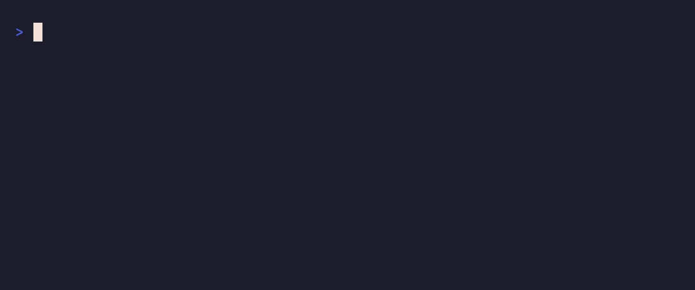
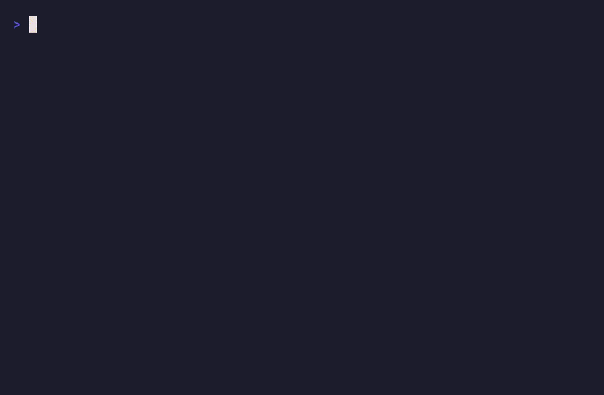
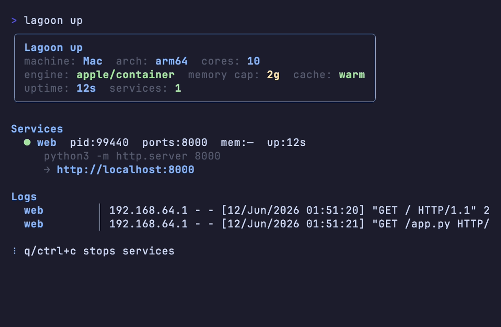
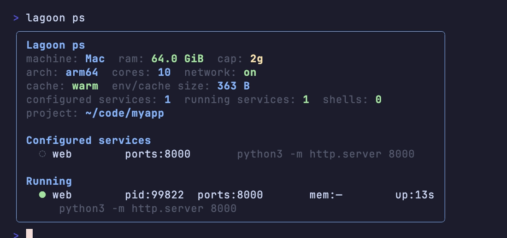

<div align="center">

# lagoon

Fast, reproducible dev environments for Linux and macOS.

[](https://github.com/imraghavojha/lagoon/releases)
[](go.mod)
[](#installation)



</div>

lagoon creates isolated project environments from a single committed config file. On Linux it builds them from pinned [Nix](https://nixos.org) packages and sandboxes them with [bubblewrap](https://github.com/containers/bubblewrap) — no daemon, no root, no images. On macOS it boots each environment in its own lightweight VM through [apple/container](https://github.com/apple/container), with warm starts around one second on Apple Silicon. Docker is used automatically as a fallback engine.

Commit `lagoon.toml` and every machine — your laptop, a teammate's Mac, a Raspberry Pi — gets the same environment.

## Features

- **`lagoon shell`** — drop into an isolated shell with your project mounted at `/workspace`
- **`lagoon up`** — run the services in your config with a live dashboard: status, ports, logs
- **`lagoon save` / `load`** — move environments to offline machines as a single file
- **`lagoon docker`** — export a Docker-compatible image tar, no daemon needed to build it
- **Pinned dependencies** — a locked nixpkgs commit on Linux, explicit images on macOS
- **Memory caps** — `-m 512m` enforced by systemd on Linux, by the VM on macOS
- **No daemon on Linux** — environments are processes, not containers

## Installation

### macOS

Requires Apple Silicon and macOS 15 or later.

```sh
brew install container && container system start   # container engine
curl -fsSL https://raw.githubusercontent.com/imraghavojha/lagoon/main/install.sh | bash
```

If apple/container is not installed, lagoon falls back to Docker Desktop automatically.

### Linux

Requires bubblewrap, Nix, and unprivileged user namespaces (arm64 or amd64).

```sh
sudo apt install bubblewrap
sh <(curl -L https://nixos.org/nix/install) --no-daemon
source ~/.nix-profile/etc/profile.d/nix.sh

curl -fsSL https://raw.githubusercontent.com/imraghavojha/lagoon/main/install.sh | bash
```

### From source

```sh
git clone https://github.com/imraghavojha/lagoon && cd lagoon
go build -o lagoon .
```

## Quick start

Initialize a project. The wizard detects your hardware, offers presets (Python, Node, Go, llama.cpp, whisper.cpp), and previews the config before writing anything:

```sh
lagoon init
```

<div align="center"></div>

Enter the environment, or run a one-off command:

```sh
lagoon shell
lagoon run pytest -x
```

Define services in `lagoon.toml` and start them. Ports are inferred from the commands and reachable on localhost:

```toml
[up]
web = "python3 -m http.server 8000"
```

```sh
lagoon up
```

<div align="center"></div>

Check what's running:

<div align="center"></div>

## Commands

| Command | Description |
| --- | --- |
| `lagoon init` | Create `lagoon.toml` interactively with hardware detection and live package search |
| `lagoon shell` | Enter the sandboxed environment |
| `lagoon run <cmd>` | Run a one-off command in the sandbox |
| `lagoon up` | Start `[up]` services with a live dashboard (`q` to stop) |
| `lagoon ps` | Show machine, cache, and running processes (`--all` for every project) |
| `lagoon watch <cmd>` | Re-run a command on file changes (requires watchexec) |
| `lagoon check` | Validate `lagoon.toml` and verify packages exist in nixpkgs |
| `lagoon save <file>` | Export the environment for offline transfer |
| `lagoon load <file>` | Import an environment archive |
| `lagoon docker <file>` | Export a Docker-compatible image tar |
| `lagoon rm` | Remove the project's cached environment |

## Configuration

`lagoon.toml` lives in your project root and is meant to be committed.

```toml
packages = ["python311", "uv"]

# pinned nixpkgs revision — set by lagoon init, used on Linux
nixpkgs_commit = "26eaeac4e409d7b5a6bf6f90a2a2dc223c78d915"
nixpkgs_sha256 = "1knl8dcr5ip70a2vbky3q844212crwrvybyw2nhfmgm1mvqry963"

profile = "network"          # "minimal" (no network) or "network"
memory_cap = "2g"            # default memory limit for shells and services
image = "python:3.12-slim"   # optional: container image used on macOS
on_enter = "uv sync"         # optional: runs on every shell entry

[up]
web = "python3 -m http.server 8000"
```

| Key | Required | Description |
| --- | --- | --- |
| `packages` | yes | Nix package names ([search](https://search.nixos.org/packages)) |
| `nixpkgs_commit` / `nixpkgs_sha256` | yes | Pinned nixpkgs revision; written by `lagoon init` |
| `profile` | no | `minimal` (default, no network) or `network` |
| `memory_cap` | no | Default memory limit, e.g. `768m`, `2g` |
| `image` | no | macOS container image override; ignored on Linux |
| `on_enter` | no | Shell command run on every sandbox entry |
| `[up]` | no | Table of service name → command for `lagoon up` |

## How it works

| | Linux | macOS |
| --- | --- | --- |
| Packages | resolved from the pinned nixpkgs commit via `nix-shell` | provided by the preset's image (`python:3.12-slim`, `node:22-slim`, `golang:1.24`, …) or an explicit `image` |
| Isolation | bubblewrap user namespaces — empty filesystem, project at `/workspace`, ephemeral `$HOME` | one lightweight VM per environment via apple/container (or a Docker container) |
| Warm start | cached `nix-shell` resolution, no process overhead | VM boot, ~1s on Apple Silicon |
| `save` / `load` | Nix closure (`.nar`) via `nix-store --export` | OCI image tar |

On Linux, `lagoon shell` generates a `shell.nix` from your config, resolves it once, caches the result, and `exec`s into a bubblewrap sandbox. Nothing runs when you're not in a shell.

On macOS, the same config maps to a container image and lagoon drives the engine CLI directly — `lagoon up` publishes each service's inferred ports so localhost works exactly like docker-compose.

## Development

```sh
go build -o lagoon .
go test ./...
```

The demo recordings in [`assets/`](assets/) are made with [vhs](https://github.com/charmbracelet/vhs); the tapes live in [`assets/tapes/`](assets/tapes/) and run against the real binary.
